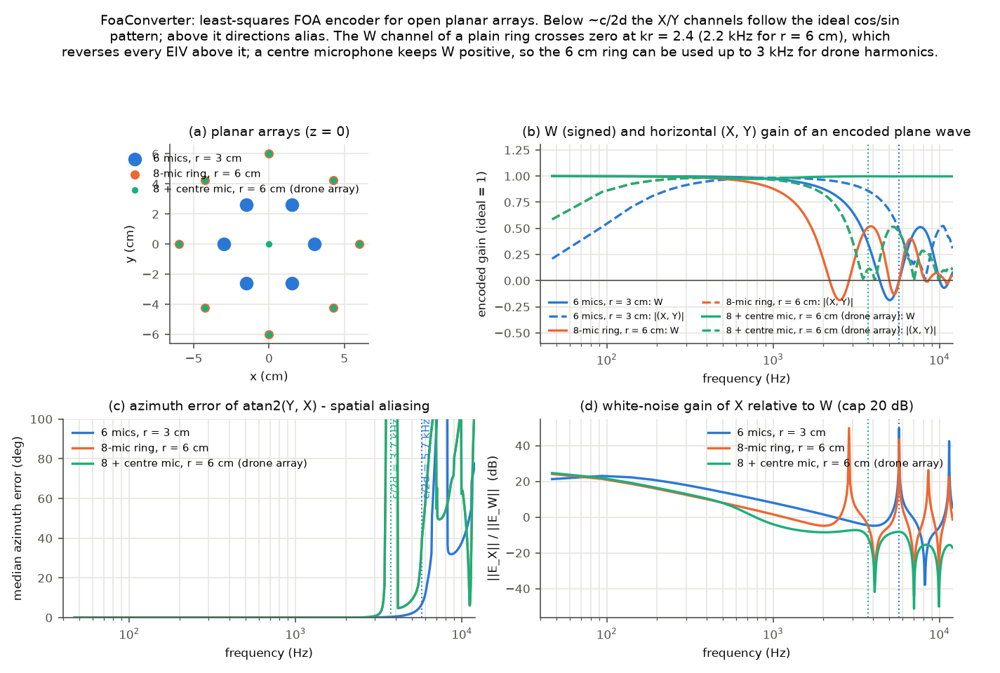
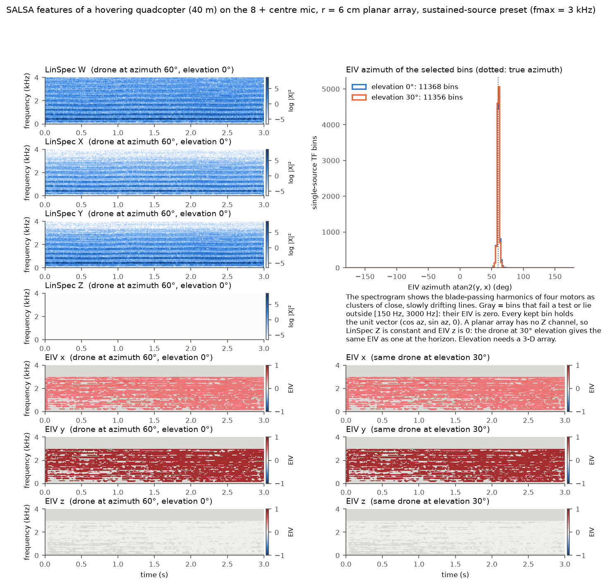
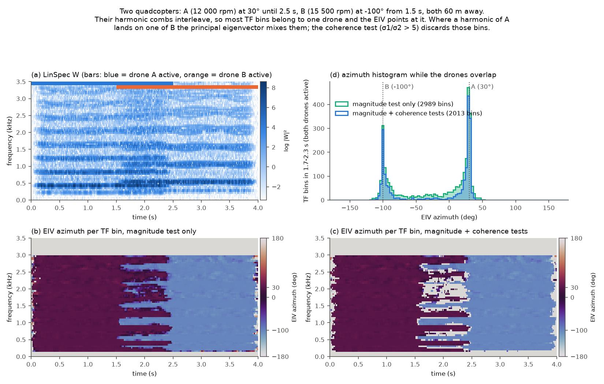
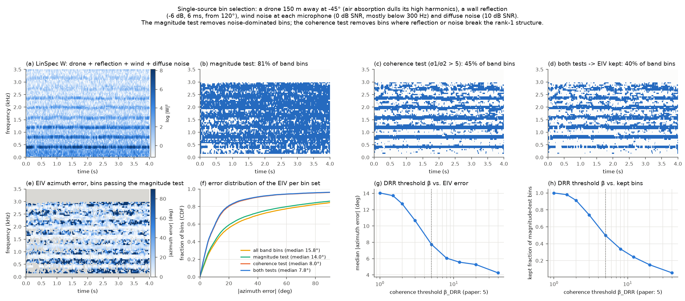
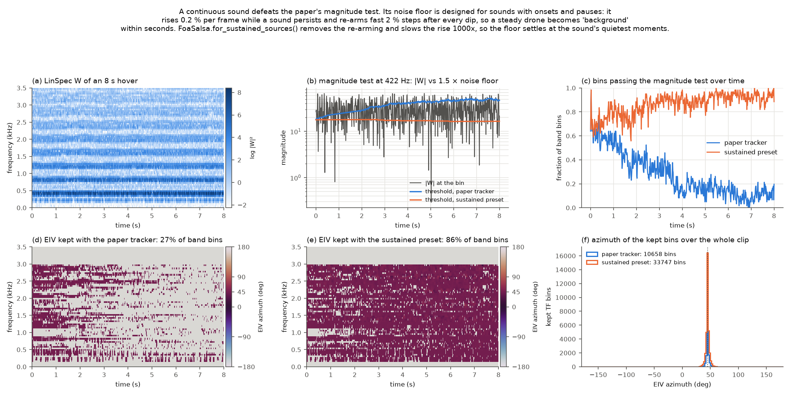
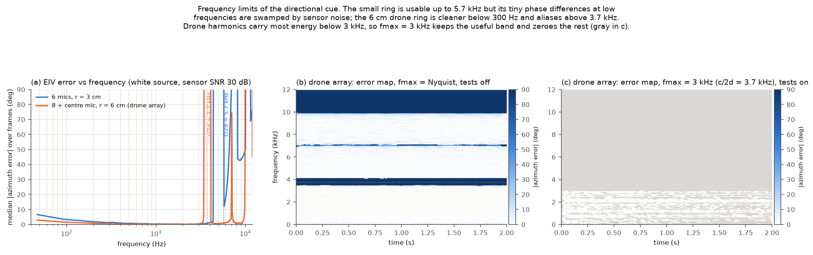
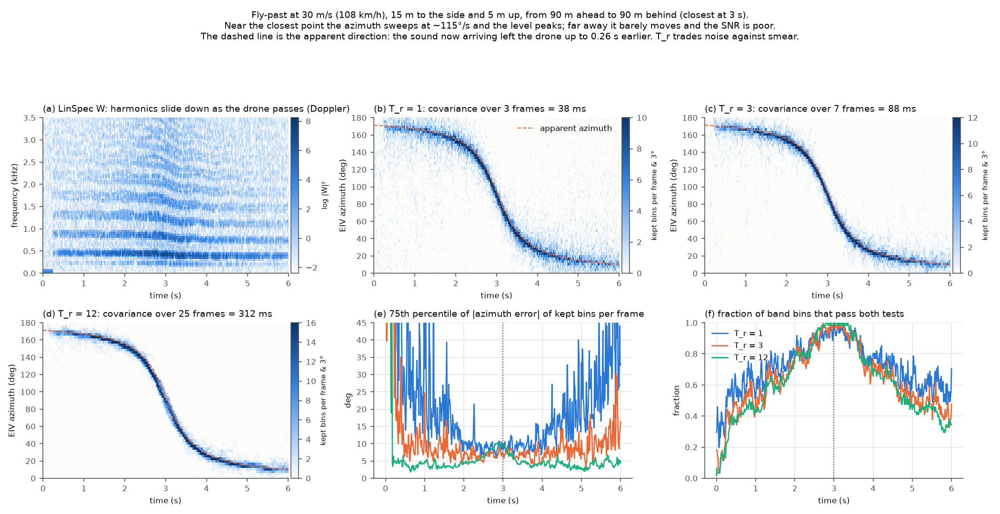

# SALSA examples explained

A plain-language guide to the seven figures produced by `python -m foasalsa.examples <output_dir>`, built around the sound of a quadcopter. The figures shown here were generated with the default settings; re-running the command reproduces them exactly.

## What the code does, in one paragraph

A microphone array records sound with several microphones at once. Because the microphones sit at slightly different places, a sound from the left reaches the left microphone a fraction of a millisecond before the right one. The FoaConverter turns those raw microphone recordings into FOA (First-Order Ambisonics), a 4-channel format: W holds the overall sound, and X, Y, Z hold how much of it travels along the front-back, left-right and up-down axes. The FoaSalsa class then computes SALSA (Spatial Cue-Augmented Log-Spectrogram) features, the input of the neural network in the paper. For every small cell of the spectrogram, a TF bin (time-frequency bin: one short time slice times one narrow frequency band), SALSA stores how loud each of the 4 channels is, plus an EIV (eigenvector-based intensity vector): a small arrow (x, y, z) of length 1 that points at the sound source in that cell. The arrow is only kept in cells where the code is confident that one single sound dominates; everywhere else it is set to zero.

## Why the examples use a quadcopter and a flat array

The target sound is the propellers of a fibre-optic-controlled quadcopter. Such a drone sends no radio signal, so sound is the main way to notice it. Its sound is very different from the speech and household sounds the paper was tested on: it is continuous, it consists of clusters of harmonics (multiples of the blade-passing frequency, one set per motor), it is usually far away, and it moves. All scenes therefore use a synthetic quadcopter: four motors at slightly different, slowly wandering speeds, plus a hiss of turbulence, passed through the air (which dulls the high frequencies over distance) and, where relevant, through motion (which shifts the pitch, the Doppler effect). The arrays are flat: a ring of 8 microphones with a 6 cm radius plus one in the centre, and a small 6-microphone ring for comparison. A flat array keeps directions to a single compass angle (0° is straight ahead, 90° is left, -90° is right, 180° is behind) and keeps the plots simple, but it cannot tell whether a sound comes from above or below; example 2 shows that limitation honestly. Every scene is synthetic, so the true direction is always known and any error in the plots is caused by the algorithm and the array, not by the data.

## What changed for drones

The two classes are unchanged. What changed are the settings and the scenes. FoaSalsa gained a preset, for_sustained_sources(), because the paper's magnitude test slowly learns to treat a continuous sound as background noise (example 5). The analysis band is set to 150 Hz to 3 kHz: above wind noise, below the array's limits, and covering the strongest propeller harmonics. And the array got a centre microphone, because the average of a plain ring of microphones reverses sign above a certain frequency and flips every direction arrow with it (example 1).

## Abbreviations used

| Short | Full form | Meaning |
|---|---|---|
| FOA | First-Order Ambisonics | the 4-channel W, X, Y, Z sound-field format that SALSA expects as input. |
| SALSA | Spatial Cue-Augmented Log-Spectrogram | the 7-channel feature from the paper: 4 loudness maps plus a 3-component direction arrow per cell. |
| TF bin | time-frequency bin | one cell of a spectrogram: a 21 ms time slice times a 47 Hz frequency band. |
| STFT | short-time Fourier transform | the operation that cuts the audio into short slices and splits each slice into frequencies, producing the spectrogram. |
| LinSpec | log-linear spectrogram | loudness of a channel per TF bin, on a logarithmic scale, with frequencies spaced evenly (not on a mel scale). |
| EIV | eigenvector-based intensity vector | the unit-length arrow (x, y, z) that points at the sound source in a TF bin. |
| DOA | direction of arrival | the direction a sound comes from. |
| DRR | direct-to-reverberant ratio | the paper's name for sigma1/sigma2, the ratio of the two largest eigenvalues of the covariance matrix; high means one clean sound dominates the cell. |
| SNR | signal-to-noise ratio | how much louder the wanted sound is than the noise, in decibels (dB). |
| T_r | covariance window half-width | the number of neighbouring frames on each side that are averaged before the arrow is computed (paper: 3, so 7 frames in total). |
| c/2d | spatial aliasing frequency | speed of sound divided by twice the microphone spacing; above it, different directions produce the same pattern of delays and cannot be told apart. |
| rpm | revolutions per minute | motor speed; the blade-passing frequency is rpm / 60 times the number of blades (12 000 rpm with 2 blades gives 400 Hz). |
| kr | wavenumber times radius | the array radius measured in wavelengths (times 2 pi); the average over a ring of microphones crosses zero at kr = 2.4. |

## Example 1: The converter: how well can a flat array produce FOA at all?

**Why this example**

SALSA (Spatial Cue-Augmented Log-Spectrogram) features are only as good as the FOA (First-Order Ambisonics) signal they are computed from. Real recordings come from microphones, not from FOA, so the first thing to check is where the conversion works and where it breaks. Three flat arrays are compared: a small 6-microphone ring (3 cm radius), a plain 8-microphone ring (6 cm radius) and the same ring with a ninth microphone in the centre. The array size sets the two limits that show up in every later example, and the centre microphone fixes a trap that would otherwise reverse the drone's direction in part of the band.

**What the plot shows**

- **(a)** The three arrays seen from above. All lie flat (z = 0).
- **(b)** A test sound is sent from every compass direction and encoded. Solid lines: the W (overall) channel, drawn with its sign. Ideally it is 1 at all frequencies. For the plain rings it falls and then goes negative, at 2.2 kHz for the 6 cm ring and 4.4 kHz for the 3 cm ring (this happens at kr = 2.4, where kr is the ring radius in wavelengths times 2 pi). A negative W flips the sign of X/W and Y/W, so every direction arrow above that frequency points backwards. With a centre microphone (green) W stays at exactly 1, because the centre microphone already is the ideal omnidirectional sensor. Dashed lines: the strength of the direction channels X and Y. For the small ring they fade below about 300 Hz, where its tiny delay differences would need more than the 20 dB of amplification the converter allows (its regularisation).
- **(c)** The direction estimated from X and Y versus the true direction. It is essentially exact up to a certain frequency and then jumps to random values. The dotted lines mark c/2d (the spatial aliasing frequency, speed of sound divided by twice the microphone spacing): 3.7 kHz for the 6 cm rings and 5.7 kHz for the small one. Above it two different directions can produce exactly the same set of delays, so no algorithm can tell them apart.
- **(d)** How much microphone self-noise is amplified into the X channel compared with W. At low frequencies it flattens at the 20 dB cap instead of growing without limit. The centre microphone also lowers the noise gain in the middle of the band, because W no longer has to be reconstructed from the ring.

**Takeaway.** For drone harmonics up to 3 kHz the 6 cm ring plus centre microphone is the array to use: clean at low frequencies, no sign flip, aliasing only above 3.7 kHz. FoaSalsa is therefore run with fmin = 150 Hz and fmax = 3 kHz.

## Example 2: A hovering drone: what the seven SALSA channels look like

**Why this example**

Before looking at hard cases it helps to see the feature itself on the simplest scene: one quadcopter hovering 40 m away at azimuth 60°, with a little sensor and background noise. The same drone is then repeated at 30° above the horizon, which is where drones usually are, to show what a flat array can and cannot see.

**What the plot shows**

- **Left column, rows 1-4** The four LinSpec (log-linear spectrogram) channels. Dark blue is loud. Instead of syllables there are horizontal lines: the harmonics of the blade-passing frequency of each motor (about 400 Hz and its multiples), each one a small cluster because the four motors run at slightly different speeds and drift. X is fainter than Y because a sound at 60° has cos(60°) = 0.5 of its strength along the front-back axis and sin(60°) = 0.87 along the left-right axis. LinSpec Z is perfectly flat: a flat array has no up-down information.
- **Left column, rows 5-7** The three components of the EIV (eigenvector-based intensity vector). Every kept cell holds the same arrow (0.5, 0.87, 0): light red in EIV x, dark red in EIV y, and exactly zero (white) in EIV z. Gray cells are the ones where the arrow was discarded: the gaps between harmonics, where only noise is present, and everything above the 3 kHz limit chosen for this array.
- **Right column, top** A histogram of the arrow directions of all kept cells. Both runs produce one sharp peak at the true 60°, with about 11 400 cells each.
- **Right column, bottom** The EIV channels when the drone is 30° above the horizon. They are indistinguishable from the ones on the left. A flat array only sees the shadow of the direction on the ground, and because the arrow is normalised to length 1, even the shorter shadow is stretched back to a full-length arrow. The elevation is simply gone.

**Takeaway.** SALSA lines up the loudness maps and the direction arrows cell by cell, and for a drone the useful cells are the harmonic lines. With a flat array, expect a good azimuth and no elevation; the constant Z channel carries no information. Elevation needs a microphone out of the plane.

## Example 3: Two drones at once: the cell-by-cell direction map

**Why this example**

The main claim of the paper is that direction information is stored per TF bin (time-frequency bin) so that overlapping sounds can still be separated: each cell points at whichever sound is loudest in that cell. This scene has drone A (12 000 rpm) at 30° until 2.5 s and drone B (15 500 rpm) at -100° from 1.5 s, both 60 m away, so they overlap for one second. Because their motor speeds differ, their harmonic combs interleave rather than coincide.

**What the plot shows**

- **(a)** The W spectrogram. The coloured bars at the top mark when each drone is active. In the overlap two combs of lines with different spacing are both visible.
- **(b)** The direction of the arrow in every cell, drawn as a colour: dark red is 30° (drone A), blue is -100° (drone B). Cells that fail the magnitude test are gray. During the overlap, whole horizontal stripes flip to blue where B's harmonics sit while the stripes in between stay red: the map switches per cell, not per time frame.
- **(c)** The same map after the coherence test. The cells at the edges of the stripes, where a harmonic of A and one of B are equally loud and the arrow points somewhere between them, are now gray. What remains is two clean colours.
- **(d)** A histogram of the arrow directions during the overlap. Both settings show two peaks at the true directions. Without the coherence test there is a floor of in-between directions from -90° to 30°; with it that floor drops away, at the cost of fewer cells (2 989 to 2 013).

**Takeaway.** Two drones do not blur into one average direction; they split by harmonic. The coherence test throws away the cells where the two combs really do collide, which is what makes the surviving arrows trustworthy. This is also why two drones with identical motor speeds would be much harder to separate.

## Example 4: Choosing trustworthy cells: the magnitude and coherence tests

**Why this example**

Only a fraction of the cells in a real recording contain one clean sound. SALSA uses two tests to find them. The magnitude test keeps cells that are clearly louder than a slowly adapting estimate of the background noise. The coherence test keeps cells whose DRR (direct-to-reverberant ratio, the ratio sigma1/sigma2 of the two largest eigenvalues) is above 5, meaning one sound dominates. This scene makes both tests work hard: a drone 150 m away at -45°, so faint and with its high harmonics dulled by the air; a reflection of the same sound from a wall, arriving 6 ms later from 120° at half strength; wind noise at every microphone (as loud as the drone, but mostly below 300 Hz and different at each microphone); and diffuse background noise 10 dB below the drone.

**What the plot shows**

- **(a)** The W spectrogram. The harmonic lines are still visible but the background is high everywhere.
- **(b), (c), (d)** The cells kept by each test (blue). The magnitude test keeps 81% of the cells in the analysis band, including plenty of noise between the harmonics, because the noise floor is only a rough guide. The coherence test is much stricter (45%) and follows the harmonic lines closely. Both together keep 40%.
- **(e)** The error of the arrow direction, in degrees, for every cell that passed the magnitude test. Dark cells have large errors; they sit between the harmonic lines, where noise and the reflection dominate.
- **(f)** How the errors are distributed for four sets of cells. Taking all cells, half of them are more than 16° off. The magnitude test alone brings the median to 14°; the coherence test alone to 8.0°; both together to 7.8°. The coherence test does almost all the work here, because wind noise is different at every microphone and therefore never looks like a single source.
- **(g), (h)** What happens when the coherence threshold is changed. Raising it from 1 to 10 cuts the median error from 14° to 6°, and further raising it keeps helping a little, but the fraction of kept cells falls steadily, to 5% at a threshold of 40. The paper's value of 5 (dotted line) keeps half of the cells at 7.7° median error.

**Takeaway.** For a distant drone the coherence test is the important one: it separates a point source from wind and diffuse noise using the spatial structure, not the loudness. The threshold trades quantity for quality; the paper's 5 is a sensible middle, and a slightly higher value is defensible when cells are plentiful.

## Example 5: A long hover: why the paper's magnitude test needs a preset

**Why this example**

The paper's magnitude test compares each cell with an adaptive noise floor. That floor was designed for sounds with onsets and pauses: after three frames above the floor it keeps rising by 0.2% per frame, and every time the signal dips below the floor it re-arms three fast 2% steps. A drone that hovers for minutes has no pauses, so the floor slowly climbs up to the drone itself and the drone becomes 'background'. This scene is an 8 s hover at 45°, analysed once with the paper's settings and once with FoaSalsa.for_sustained_sources(), which removes the fast re-arming and slows the rise a thousandfold.

**What the plot shows**

- **(a)** The W spectrogram: steady harmonic lines for 8 s.
- **(b)** At the strongest harmonic (422 Hz): the cell's loudness (gray, fluctuating because the four motors beat against each other) and the pass threshold of each tracker (1.5 times its noise floor). The paper's threshold (blue) climbs through the signal within 3 s; the preset's threshold (orange) settles just below the signal's quiet moments and stays there.
- **(c)** The share of cells in the band that pass the magnitude test, over time. With the paper's tracker it decays from 60% to about 10%; with the preset it rises to about 90% and stays.
- **(d), (e)** The direction maps of the kept cells. The paper's tracker keeps 27% of the band and loses most of it in the second half; the preset keeps 86% for the whole clip.
- **(f)** Both settings produce a sharp peak at the true 45°, so the cells the paper's tracker throws away were not wrong, just declared 'background': 10 658 kept cells against 33 747.

**Takeaway.** A continuous sound is the one case the paper's magnitude test was not built for. The preset keeps the tracker but turns it into a slow minimum tracker, so a drone stays detectable for minutes while the floor still follows slow changes of the weather. Alternatively the magnitude test can be switched off and the coherence test used alone.

## Example 6: Which frequencies to trust: fmin and fmax

**Why this example**

The paper computes arrows between 50 Hz and 9 kHz because its recordings come from a dense 32-microphone sphere. For a small flat array those limits are wrong, and this example shows how to find the right ones. A white-noise sound (it contains all frequencies equally) is played from 45° to the small ring and to the drone array, with sensor noise 30 dB below the sound. All cell-selection tests are switched off in (a) and (b) so that the raw behaviour of the arrow is visible.

**What the plot shows**

- **(a)** The typical arrow error per frequency. Low end: the small ring (blue) starts at 6° error at 50 Hz and only becomes exact above about 300 Hz, because its delay differences at those frequencies are as small as the sensor noise; the drone array (orange) starts at 2° and is exact almost immediately. High end: the drone array breaks down above about 3.5 kHz and the small ring above about 5 kHz, close to their c/2d aliasing frequencies of 3.7 and 5.7 kHz. Above those, the error swings wildly with frequency.
- **(b)** The error map for the drone array with the analysis band opened all the way to 12 kHz. Below 3.5 kHz the map is nearly white (correct); above it there are wide dark bands of wrong directions that are consistent over time, so they would look like confident but false cues to a network.
- **(c)** The same recording processed with fmax = 3 kHz and the tests switched on. The whole unreliable region is gray (arrow set to zero) and the remaining band is white. Wind noise lives below 300 Hz, which is why the drone preset also raises fmin to 150 Hz.

**Takeaway.** fmin and fmax are properties of the microphone array and the environment, not of the algorithm. For the drone array, 150 Hz to 3 kHz covers the strongest propeller harmonics and excludes wind noise and aliasing.

## Example 7: A fast fly-past: Doppler, delay and how many frames to average

**Why this example**

The arrow in each cell is not computed from a single frame but from the covariance of the current frame together with T_r frames on each side (paper: T_r = 3, so 7 frames or 88 ms). Averaging reduces noise but assumes the sound does not move within the window. This scene has a drone passing at 30 m/s (108 km/h), 15 m to the side and 5 m up, from 90 m ahead to 90 m behind, with strong background noise. Near the closest point the direction sweeps at about 115° per second; far away it barely moves but the drone is faint.

**What the plot shows**

- **(a)** The W spectrogram. The harmonic lines bend downwards as the drone passes: the Doppler effect. The pitch is about 9% higher while it approaches and 9% lower while it recedes. The bins the harmonics occupy therefore change over time, but the direction stored in each bin is unaffected.
- **(b), (c), (d)** For every frame, a histogram of the arrow directions of the kept cells, drawn as a vertical strip; the dashed orange line is the apparent direction, the direction of the point where the drone was when the sound now arriving left it (up to 0.26 s earlier, which shifts the line by a few degrees). With T_r = 1 the strip is wide and speckled far from the array; with T_r = 3 it is tight; with T_r = 12 (312 ms) it is tightest, and even at the closest point the smear from motion inside the window is barely visible.
- **(e)** The error that 75% of the kept cells stay below, per frame. Far from the array T_r = 1 is very noisy (20° to 40°), T_r = 3 sits around 7° and T_r = 12 around 4°. Near the closest point (dotted line) all three meet at about 10°: there the error is dominated by the motion, not by noise.
- **(f)** The share of cells that pass both tests. It rises from 20% when the drone is far to nearly 100% at the closest point and falls again. Longer windows lose a few percent of cells far away, where the sound is faint.

**Takeaway.** Longer averaging fights noise, which is the dominant problem for a distant drone, and the window is centred so it adds no delay. Motion only starts to matter for a close, fast pass. For drone detection a window longer than the paper's 7 frames is a reasonable choice, and the sound's own travel time already delays the apparent direction by up to a few tenths of a second at range.
